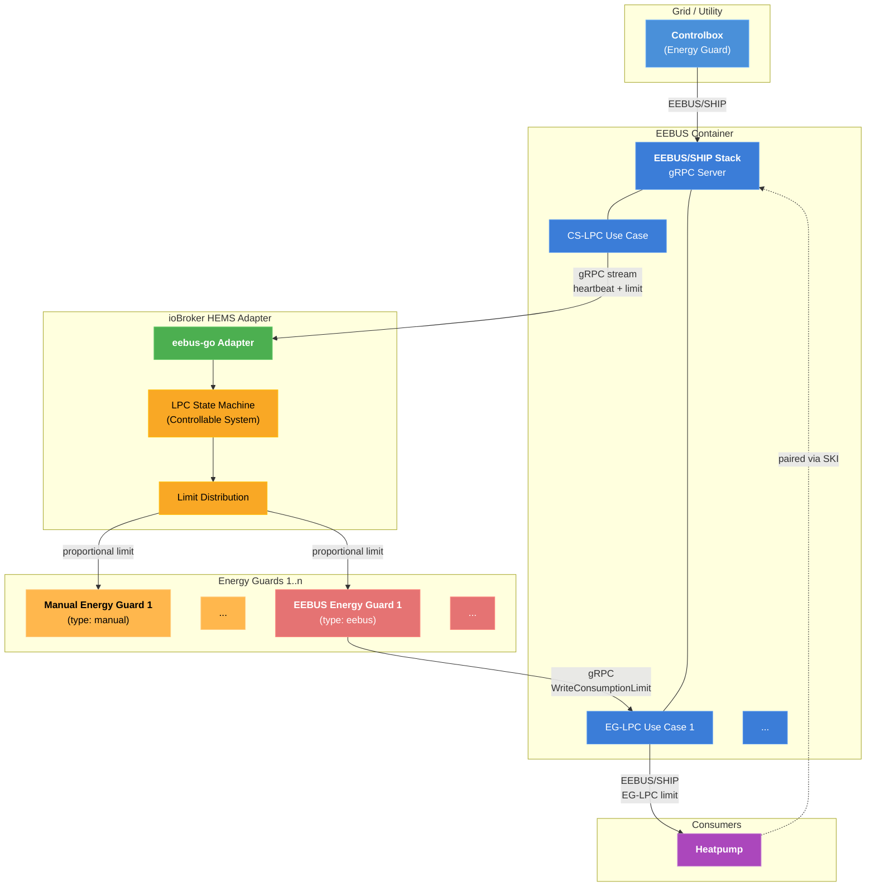

# Architecture Scenario: Controlbox + EEBUS Energy Guard + Manual Energy Guard

## Component Description

| Component               | Role                                                                                                                                                                 |
| ----------------------- | -------------------------------------------------------------------------------------------------------------------------------------------------------------------- |
| **Controlbox**          | Grid operator device that sends consumption limits via EEBUS/SHIP protocol.                                                                                          |
| **EEBUS Container**     | Docker/Podman container running the eebus-go SHIP stack. Handles all EEBUS/SHIP networking, mDNS discovery, and SPINE data model. Exposes a gRPC API to the adapter. |
| **CS-LPC Use Case**     | Controllable System — Limitation of Power Consumption. Receives limits from the controlbox.                                                                          |
| **EG-LPC Use Case**     | Energy Guard — Limitation of Power Consumption. Sends limits to paired consumer devices.                                                                             |
| **eebus-go Adapter**    | ioBroker adapter that communicates with the container via gRPC and manages the LPC state machine.                                                                    |
| **LPC State Machine**   | Implements CS LPC states (init, unlimitedControlled, limited, failsafe, unlimitedAutonomous).                                                                        |
| **Limit Distribution**  | Distributes the controlbox limit proportionally across energy guards by configured percentage.                                                                       |
| **EEBUS Energy Guard**  | Forwards its limit share to the heatpump via the container's EG-LPC gRPC endpoint. Also accepts manual limits from the operator (60 min duration).                   |
| **Manual Energy Guard** | No EEBUS connection. Limit is set manually by an operator via ioBroker state objects.                                                                                |
| **Heatpump**            | Consumer device paired with the container via SKI. Receives EG-LPC limits over EEBUS/SHIP.                                                                           |

## Data Flow

1. The **Controlbox** connects to the **EEBUS Container** via EEBUS/SHIP protocol (mDNS discovery, SKI trust).
2. The container's **CS-LPC Use Case** streams heartbeat and limit events to the **Adapter** over gRPC.
3. The **LPC State Machine** transitions based on heartbeat and limit messages.
4. When a limit is active, **Limit Distribution** splits it across energy guards by percentage.
5. The **EEBUS Energy Guard** calls `WriteConsumptionLimit` on the container's **EG-LPC** gRPC endpoint.
6. The container forwards the EG-LPC limit to the **Heatpump** over EEBUS/SHIP.
7. The **Manual Energy Guard** applies its limit based on operator input (no EEBUS involved).
8. The operator can also set a **manual limit** on the **EEBUS Energy Guard** (60 min duration, sent to heatpump via container). This is reset when the controlbox limit becomes active.
