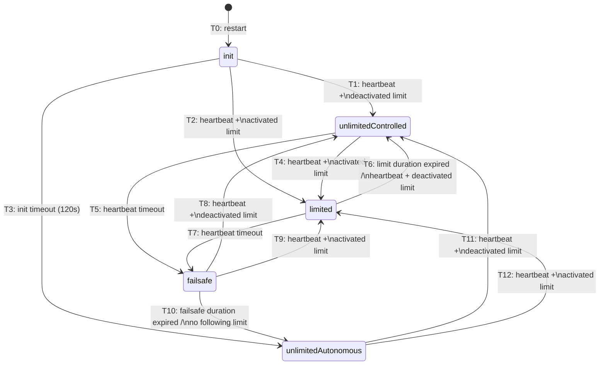

# LPC State Machine (CS-LPC §2.3.2)

## States

| State                   | Description                                                                                      |
| ----------------------- | ------------------------------------------------------------------------------------------------ |
| **init**                | CS starts here after (re)start. Limited by failsafe power limit. Waits 120s for first heartbeat. |
| **unlimitedControlled** | CS not limited, but controlled by Energy Guard. Heartbeat active.                                |
| **limited**             | CS in limited state, controlled by Energy Guard. Active power limit applies.                     |
| **failsafe**            | CS not controlled by Energy Guard. Limited by failsafe limit. Timer running.                     |
| **unlimitedAutonomous** | CS not limited. Consumes as if no external limitation exists. Control box disconnected.          |

## Transitions

| ID  | Trigger                                          | Description                                        |
| --- | ------------------------------------------------ | -------------------------------------------------- |
| T0  | restart                                          | Any state → init on adapter restart                |
| T1  | heartbeat + deactivated limit                    | First heartbeat received, no active limit          |
| T2  | heartbeat + activated limit                      | First heartbeat received with active limit         |
| T3  | init timeout (120s)                              | No heartbeat received within 120 seconds           |
| T4  | heartbeat + activated limit                      | Limit activated while in unlimited controlled      |
| T5  | heartbeat timeout                                | Heartbeat lost in unlimited controlled             |
| T6  | limit duration expired / heartbeat + deactivated | Limit ends or is deactivated                       |
| T7  | heartbeat timeout                                | Heartbeat lost while limited                       |
| T8  | heartbeat + deactivated limit                    | Heartbeat returns, no active limit                 |
| T9  | heartbeat + activated limit                      | Heartbeat returns with active limit                |
| T10 | failsafe duration expired / no following limit   | Failsafe timer expires or explicitly no next limit |
| T11 | heartbeat + deactivated limit                    | Reconnection, no active limit                      |
| T12 | heartbeat + activated limit                      | Reconnection with active limit                     |
